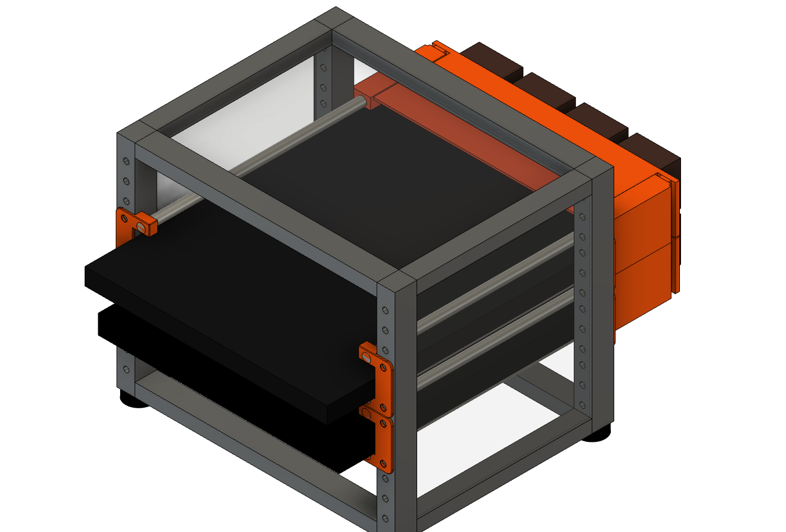
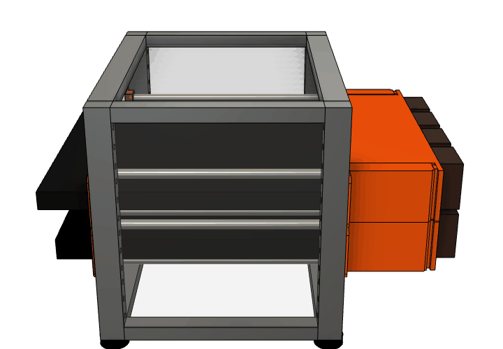
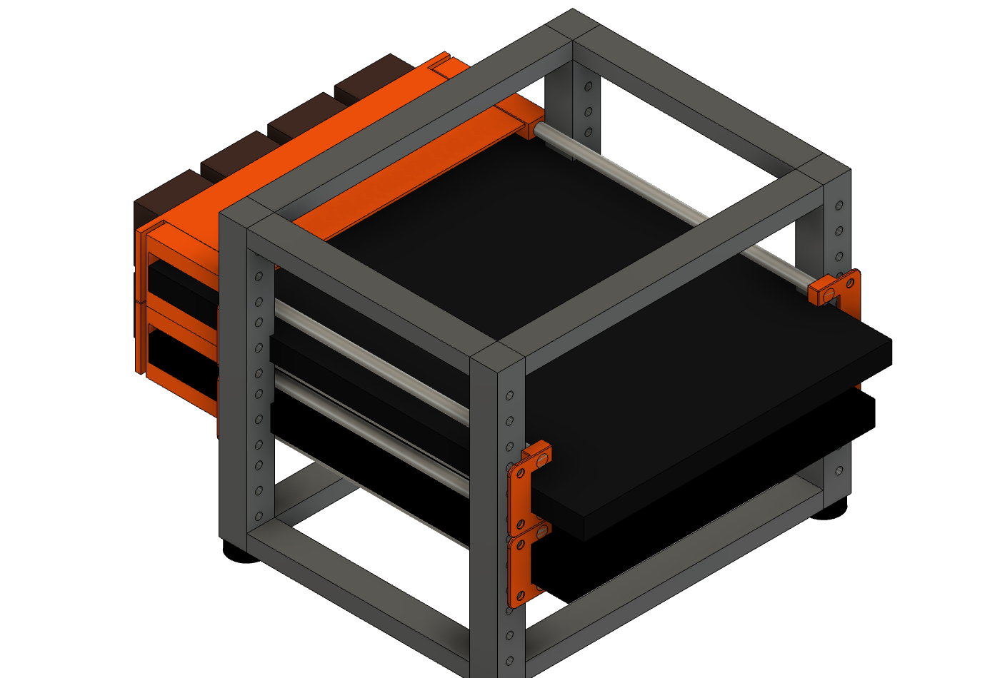
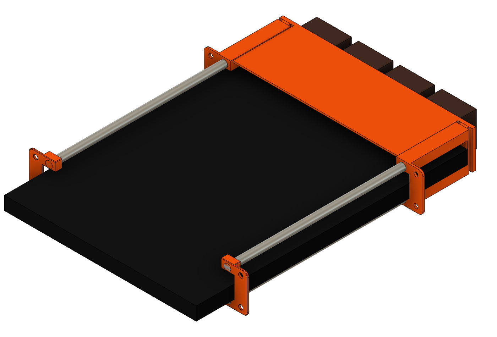
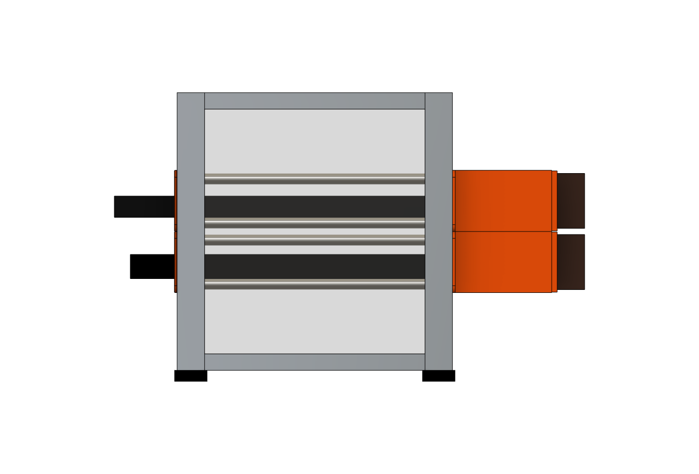

# Mini-Rack Laptop Trays

1U sliding laptop trays for 10-inch mini racks, with an actively cooled, ducted rear exhaust — designed for a MacBook Pro 14" and a Surface Laptop 13.8" living in a GeeekPi/DeskPi RackMate-style 4U cabinet.

Each laptop slides in and out like a drawer on four 8 mm smooth rods, held by 3D-printed ears on the front and rear rack rails. A printed fan bar with four 40 mm Noctua fans bolts onto the rear ears and pulls air across the top and bottom of the laptop, exhausting out the back — all within a single rack unit.

Want to spin it yourself? **[Open the interactive 3D viewer](https://mhuot.github.io/mini-rack-laptop-trays/)** — full color, drag to orbit, scroll to zoom. GitHub also renders **[docs/rack-mockup.stl](docs/rack-mockup.stl)** with its built-in STL viewer. (Both are visual mockups, not print files — the printable STLs live in [`exports/`](exports/). Printed parts are shown in orange; print in whatever color you like.)

## How it works

| | |
|---|---|
|  |  |

- **Front and rear ears** print in mirrored pairs and bolt to the rack rails with standard rack screws. Each ear carries two 8 mm smooth-rod positions, spaced to leave a 24 mm gap — the laptop slides between the rod pairs and rests on the lower rods.
- **The rear ears extend 67 mm out the back of the rack**, so the laptop's rear edge sits behind the rear rail and stops against the ears' back plates. A MacBook Pro 14 noses ~45 mm out the front; the Surface Laptop 13.8 ~33 mm.
- **The fan bar** screws into heat-set inserts in the rear ears' back plates. Four Noctua NF-A4x20 5V fans (40 mm fits upright inside the 44.45 mm rack unit) exhaust rearward. Integrated 1.8 mm duct panels close the top and bottom of the rear overhang, and the rear ears carry a 2 mm outboard side wall closing their side windows — so the fans can only draw air from inside the rack, sweeping the lid and the underside of the chassis on the way through.
- Laptops run clamshell; all cables exit at the front (orient the Surface with its USB-C edge forward).
- The RackMate-style cabinet has closed acrylic sides and top, so the front opening is the only intake: the fans drive true front-to-back flow through the slot, and the hinge-side exhaust is entrained in the same rearward stream. No side baffles needed.

## Compatibility

Designed around a rack with 236.525 mm rail-hole span and 200 mm rail-to-rail depth ([GeeekPi 4U 10-inch cabinet / DeskPi RackMate T0](https://www.amazon.com/dp/B0DPGZPTPP); see the [mini-rack project](https://mini-rack.jeffgeerling.com/) for the ecosystem).

| Laptop | Dimensions (mm) | Fit |
|---|---|---|
| MacBook Pro 14 (M-series) | 312.6 × 221.2 × 15.5 | ✅ designed for |
| Surface Laptop 7th Ed. 13.8" (Intel) | 301 × 220 × 17.5 | ✅ same parts, unchanged |

Anything ≤ 222 mm deep and ≤ ~20 mm thick that can hang its side edges on rods 205.6 mm apart should work.

## Bill of materials (per tray)

**Printed parts** (PETG recommended — parts live next to a warm laptop):

| Part | Qty | Notes |
|---|---|---|
| Front Ear (`exports/front_ear.stl`) | 2 | mirror one in the slicer |
| Rear Ear v2 (`exports/rear_ear_v2.stl`) | 2 | mirror one; bosses take M3 heat-set inserts |
| Rear Fan Bar (`exports/rear_fan_bar.stl`) | 1 | prints flat, duct panels up, no supports |

**Ready-made print plates:** `exports/print_plate_one_tray_heatset.3mf` (also `_selftap` / `_nuttrap`) opens in PrusaSlicer with a complete tray set arranged for a 250 × 210 bed — both ears mirrored correctly and the fan bar oriented duct-panels-up. Regenerate with `scripts/build_print_plate.py`.

No heat-set inserts on hand? Two alternatives, same fan bar and M3 × 8 screws either way:

- **Nut-trap** (`exports/rear_ear_v2_nuttrap.stl`) — a slightly taller rib with side-loading slots that capture standard **M3 hex nuts** (a DIN 562 square nut fits the same slot). Metal threads, unlimited assembly cycles, hardware you already have. The fan bar sits 2 mm further back (~98 mm total behind the rear rail).
- **Self-tap** (`exports/rear_ear_v2_selftap.stl`) — Ø2.5 pilot holes the M3 screws thread directly into the plastic. Simplest, but good for only about a dozen assembly cycles.

The insert version remains the most compact and the nicest to work on.

**Hardware:**

| Item | Qty | Notes |
|---|---|---|
| 8 mm smooth rod, 243 mm | 4 | see [Smooth rods](#smooth-rods) |
| [Noctua NF-A4x20 5V](https://www.amazon.com/Noctua-NF-A4x20-5V-3-Pin-Premium/dp/B072Q3CMRW) | 4 | ships with OmniJoin + fan screws |
| [M3 × 3 mm heat-set inserts (short)](https://cnckitchenus.store/products/heat-set-insert-m3-x-3-short-version-100-pieces) | 4 | e.g. CNC Kitchen; Ø4.0 × 3.2 pockets (skip for the self-tap ear variant) |
| M3 × 8 socket-head screws | 4 | |
| M3 hex nuts | 4 | nut-trap ear variant only |
| Rack screws | 8 | per your rack's rail standard |
| USB power for fans | 1 | 5 V lead + splitter (one can feed both trays) |

## Smooth rods

Any 8 mm smooth rod works (hardened steel or stainless linear rod is ideal — it's what the renders show). The rods are just long enough to connect the front and rear ears — they do **not** extend past the front:

- **Cut all four rods to 243 mm** (the as-built length). That runs from flush with the front ear's face, through the 200 mm rack, and ~40 mm into the rear ears' bores — plenty of engagement without needing to bottom out against the rear back plates.
- The front ears straddle the front rail: only their thin 2 mm face plate (with the recessed screw heads) sits on the rail's front face, while the rod blocks pass through the rack opening behind it. The front of the rack stays essentially flush — nothing pokes forward but the laptops.
- The laptop's front overhang (MacBook Pro 14: ~45 mm, Surface 13.8: ~33 mm) is cantilevered past the front ears — the chassis is more than stiff enough for this.
- Deburr and lightly chamfer the ends so they slide into the printed bores without shaving them. The 8.0 mm fit is snug — no retention hardware needed, and the fan bar closes off the rear.

## Assembly

1. Print the parts; heat-set the four inserts into the rear ear bosses.
2. Mount front ears to the front rails, rear ears to the rear rails (rear ears point out the back of the rack).
3. Slide the four rods through the front ears into the rear ears' sockets.
4. Screw the fans to the rear face of the fan bar (labels facing back — they exhaust rearward), then drive the M3 screws through the bar's counterbored tabs into the ear inserts.
5. Wire the fans to 5 V USB and slide the laptop in, lid closed, cables at the front.

Total stack behind the rear rail is ~96 mm (ears 69 + pads 3 + bar 4 + fans 20) — leave that much clearance behind the rack.

## CAD

Models are built in Fusion 360, driven by the Python scripts in [`scripts/`](scripts/) (run inside Fusion — e.g. via a Fusion MCP add-in, or paste into a Fusion script). Each script is parametric through the constants at the top and regenerates its part from scratch:

- [`build_rear_ear_v2.py`](scripts/build_rear_ear_v2.py) — copies the proven rear ear bodies and adds the insert bosses
- [`export_front_ear.py`](scripts/export_front_ear.py) — exports the front ear with a slicer-friendly tangency relief
- [`build_print_plate.py`](scripts/build_print_plate.py) — assembles the one-tray 3MF print plates from the STLs
- [`build_rear_fan_bar.py`](scripts/build_rear_fan_bar.py) — the ducted fan bar
- [`build_rack_mockup.py`](scripts/build_rack_mockup.py) — the full-rack mockup used for the renders on this page

Fusion API note: all API lengths are centimeters; the scripts define `MM = 0.1` and work in millimeters throughout.

The original ear and reference-body designs live in the Fusion archives (`*.f3d`) at the repo root.

## License

[MIT](LICENSE) — scripts, models, and STLs alike. Attribution appreciated but not required.
